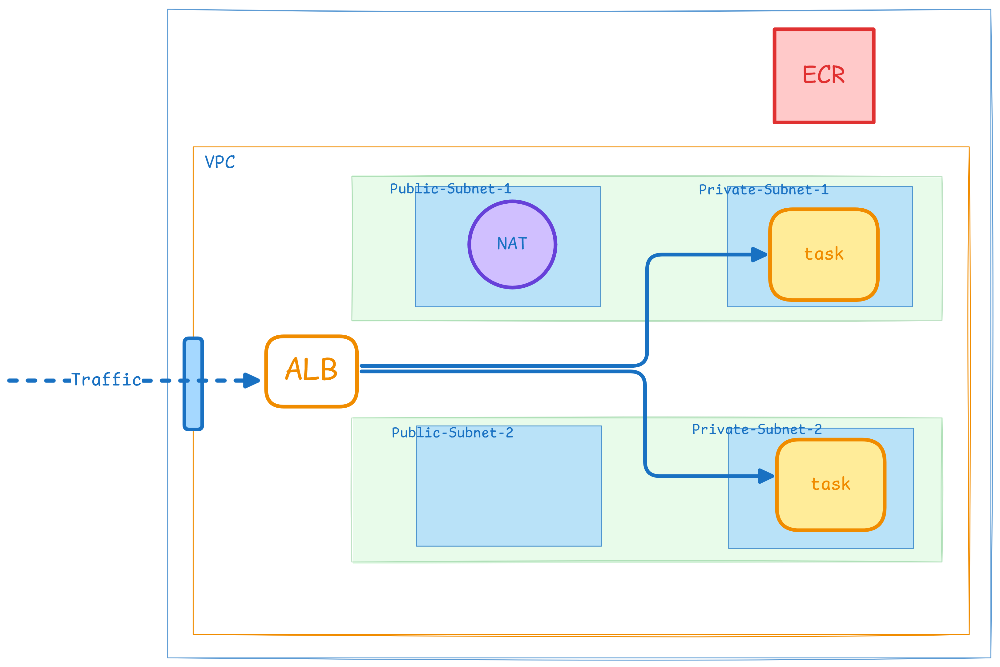

# My Journey in the quest


### 🕵🏻‍♂️ HUNT FOR SECRET_WORD 

I implemented code locally and got the below response.

```console
> kishan@DESKTOP:/mnt/c/Users/Dell/Desktop/New folder/quest/bin$ ls
001  002  003  004  005  006
> kishan@DESKTOP:/mnt/c/Users/Dell/Desktop/New folder/quest/bin$ ./001
You dont seem to be running in AWS or GCP or Azure
```

Created EC2 instance and run the code got *same error*. Checked and found the issue that need to disable to IMDSv2. And it worked!

> Note: Code doesn't gives desired response in EC2 instances with IMDSv2 enabled.

FINALLY FOUND SECRET WORD!!!

### 🟧 INFRA implementation 



For IaC, I have used _Terraform_ and _Terragrunt_.

Deployed it on AWS using below services:
- VPC
- ECR
- ECS (Fargate)
- ALB

`infra` directory contains code for infra.

### 🚧 CICD Github actions

Created a CICD pipeline to deploy the latest changes to ECS cluster.

`.github/workflows` directory for CICD Workflows.

`deployment` directory for task-definition.


## ⭐ Given more time, I would improve...

- I will create a CICD pipeline for automatic infra provisioning. (Currently we have to deploy infra manually)
- I will add Route53 and certificates to host website with HTTPS.
